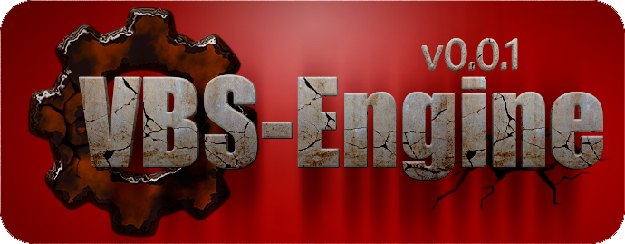

[](../../docs.md "documentation") 

[H]: ../../docs.md        "родитель"
[P]: ../../icons/progress.png  "в процессе..."
[S]: ../../icons/success.png   "ошибок не обнаружено"
[E]: ../../icons/empty.png     "нет данных"

[1]: ../reference/filemask.md
[2]: ../commands.md#--runtests "запускает тесты для указанных конфигураций"
    
[![P]][H] Процедура expand v0.0.1
=================================
Это - процедура макро-подстановки значений переменных вместо самих переменных.  
Внутри фигурных скобочек содержатся имена переменных.  
`expand` подменяет имена переменных их содержимым.  
Например, было:  

```
set "DIR_WORKSPACE=C:\workspace" 
set "NAME_PROJECT=example" 

set "eDIR_BUILD={DIR_WORKSPACE}\_build\{NAME_PROJECT}" 
```

Стало: `eDIR_BUILD=C:\workspace\_build\example`  


Рекурсивность
-------------
При однократной макро-подстановке может образоваться новая строка,  
которая тоже содержит переменную в фигурных скобках.  
В этом случае будет выполнена ещё одна макро-подстановка, и так до тех пор,  
пока все переменные в фигурных скобках не будут полностью раскрыты.  
Например, для строки:  

```
set "NAME_PROJECT=example" 
set "DIR_WORKSPACE=C:\workspace" 
set "DIR_BACK=_build\{NAME_PROJECT}" 

set "eDIR_BUILD={DIR_WORKSPACE}\{DIR_BACK}" 
```

В результате первой макро-подстановки получится: `eDIR_BUILD=C:\workspace\_build\{NAME_PROJECT}`  
Далее, `expand` заметит, что ещё остались фигурные скобки,  
и выполнит вторую макро-подстановку: `eDIR_BUILD=C:\workspace\_build\example`  

С технической точки зрения, это - рекурсивный алгоритм:  
  1. Выполняется макро-подстановка  
  2. Если после макро-подстановки значение строки изменилось, тогда выполняется пункт 1.  
     В противном случае, алгоритм завершает работу.  

<br/>


Удаление пустот
---------------
Если в результате макро-подстановки образовалась пустота,  
тогда обрамляющие символы пунктуации каллапсируют.  
Например, в следующем примере, значение переменной `NAME_BUILD` является пустота  
```
set "NAME_PROJECT=example" 
set "DIR_WORKSPACE=C:\workspace" 
set "eDIR_BUILD={DIR_WORKSPACE}\{NAME_BUILD}\{NAME_PROJECT}" 
```

После макро-подстановки получится: `eDIR_BUILD=C:\workspace\\example`  
Далее, обрамляющие символы `\\` коллапсируют,  
и в итоге получается результат: `eDIR_BUILD=C:\workspace\example`  

Другой пример: отсутствует `VERSION`  
```
set "NAME_PROJECT=example" 
set "DIR_WORKSPACE=C:\workspace" 
set "eDIR_BUILD={DIR_WORKSPACE}\build-{VERSION}\{NAME_PROJECT}" 
```

В результате получится: `eDIR_BUILD={DIR_WORKSPACE}\build\{NAME_PROJECT}`  
Символ `-` коллапсирует  

Алгоритм коллапса:  
  1. Сначала файловый путь разбивается на токены:  
     `{DIR_WORKSPACE};build-{VERSION};{NAME_PROJECT}`
  2. Далее, происходит макро-подставновка:  
     `C:\workspace;build-ПУСТОТА;example`
  3. Далее, удаляются обрамляющие знаки пунктуации слева и справа от пустой переменной.  
     В данном случае, у `пустоты` справа ничего нет.  
     А вот слева символ пунктуации `-` удаляется.  
  4. После коллапса получается: `C:\workspace;build;example`  
  5. Теперь выполняется обратное построение файлового пути из токенов:  
     `C:\workspace\build\example`  
  6. На последнем шаге алгоритм смотрит: нет ли ещё фигурных скобок?  
     Если есть, тогда весь алгоритм вновь повторяется.  
<br/>


История изменений 
-----------------

| *ID* |    дата    | время |     ветка      | version |  
|:----:|:----------:|:-----:|:--------------:|:-------:|  
| 0001 | 2025-02-27 | 19:30 | [#1-rep-first] |  0.0.1  |  

*ПРИМЕЧАНИЕ: под version подразумевается версия `project.root`*  

[#1-rep-first]: ../../history.md#-v001-rep
