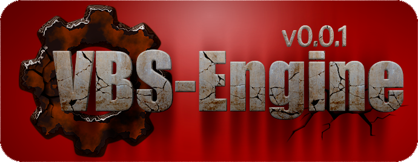

 

[H]: ../docs.md  "родитель"

[![S]][H] icons v0.0.2
======================

Базовый набор для оформления разработки.  

| **ID** |    имя   | иконка |                            описание                            | использование |  
|:------:|:--------:|:------:|:--------------------------------------------------------------:|:-------------:|  
|  0009  | na       |  ![N]  | `не доступен` функциональность не доступна                     |   изредка     |  
|  0008  | bug      |  ![B]  | `баг` обнаружен баг                                            |   изредка     |  
|  0007  | danger   |  ![D]  | `внимание` есть ограничения, недоработки, или противопоказания |   редко       |  
|  0006  | failed   |  ![F]  | `провал` задача завершена с ошибкой                            |   редко       |  
|  0005  | success  |  ![S]  | `успех` задача успешно завершена                               |   постоянно   |  
|  0004  | progress |  ![P]  | `в прогрессе` задача уже в разработке, но ещё не завершена     |   постоянно   |  
|  0003  | version  |  ![V]  | `релиз` маркировка очередной версии репозитория                |   постоянно   |  
|  0002  | release  |  ![R]  | `релиз` маркировка очередного релиза продукта                  |   постоянно   |  
|  0001  | empty    |  ![E]  | `нет данных` элемент может быть ещё только в планах.           |   постоянно   |  

[N]:  na.png
[B]:  bug.png
[D]:  danger.png
[F]:  failed.png
[S]:  success.png
[P]:  progress.png
[R]:  release.png
[V]:  version.png
[E]:  empty.png

